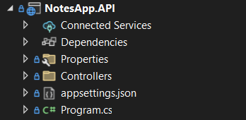

# Building a .NET Web API 🛠️

Now that we understand what APIs are and why they're important, it's time to build our first **.NET Web API** application.

.NET provides everything needed to quickly build modern, scalable and maintainable REST APIs. The Web API project template already contains the basic configuration, project structure and sample endpoints, allowing us to focus on understanding the framework and implementing business logic.

---

# Building a .NET Web API 🔸

REST is an architectural style and isn't tied to any specific programming language or framework.

We can build REST APIs using many different technologies, but .NET provides a rich set of libraries and built-in features that make API development easier.

Some of the features provided by .NET include:

- Routing
- Controllers
- Model Binding
- Dependency Injection
- Middleware
- Authentication & Authorization
- Configuration
- Logging
- OpenAPI (Swagger)

The Web API project template is very similar to the MVC template, but instead of rendering Views, it focuses on processing HTTP requests and returning responses.

### 🤖 Let's Ask AI

```
Why is .NET a good framework for building Web APIs?
```

```
Explain the difference between a .NET MVC project and a .NET Web API project.
```

```
Which built-in .NET features make Web API development easier?
```

---

# Creating a .NET Web API Project 🔸

To create a new Web API project:

1. Open Visual Studio.
2. Select **Create a new project**.
3. Choose **ASP.NET Core Web API**.
4. Configure the project name and location.
5. Select the target .NET version.
6. Enable **OpenAPI (Swagger)** support.
7. Create the project.

Visual Studio automatically generates a working Web API project with the required configuration.

The generated project contains:

- Program.cs
- appsettings.json
- Controllers
- Properties
- launchSettings.json
- Sample WeatherForecast endpoint

---

# Exploring the Project Structure

Before writing any code, take a few minutes to explore the generated project.

Some of the most important files and folders are:

## Program.cs

The application's entry point.

Responsible for:

- Registering services
- Configuring middleware
- Configuring routing
- Starting the application

## Controllers

Contains API Controllers.

Controllers expose endpoints that clients call through HTTP requests.

## appsettings.json

Contains application configuration, such as:

- Connection strings
- Logging configuration
- Environment-specific settings
- Custom application settings

## Properties

Contains launch profiles used when running the project locally.

## WeatherForecast Controller

A sample controller generated by the project template.

Although we'll eventually replace it with our own implementation, it's useful for understanding how controllers and endpoints work.



### 🤖 Let's Ask AI

```
Explain every folder generated in a new .NET Web API project.
```

```
Walk me through Program.cs line by line.
```

```
Explain the purpose of appsettings.json.
```

```
Why is the WeatherForecast controller included in the template?
```

---

# Running the Application ▶️

After creating the project:

- Build the solution.
- Run the application.
- Observe the console output.
- Open Swagger UI.
- Execute the generated WeatherForecast endpoint.

This verifies that everything has been configured correctly before implementing your own endpoints.

### 🤖 Let's Ask AI

```
What happens internally when I run a .NET Web API application?
```

```
Explain the lifecycle of an HTTP request in a .NET Web API.
```

```
How does .NET know which endpoint should handle an incoming request?
```

---

# Exercise 💻

Create your own **.NET Web API** project.

After creating it:

- Explore the project structure.
- Open Program.cs.
- Open appsettings.json.
- Find the generated controller.
- Run the project.
- Open Swagger.
- Execute the sample endpoint.

Try to understand the generated code before writing your own implementation.

### 🤖 Let's Ask AI

```
Review my newly created .NET Web API project and explain every generated file.
```

```
What files should I explore first when opening a new .NET Web API project?
```

```
If I delete the WeatherForecast controller, what will still work and why?
```

---

# Extra Materials 📘

- https://learn.microsoft.com/aspnet/core/web-api
- https://learn.microsoft.com/aspnet/core/fundamentals
- https://learn.microsoft.com/aspnet/core/fundamentals/dependency-injection