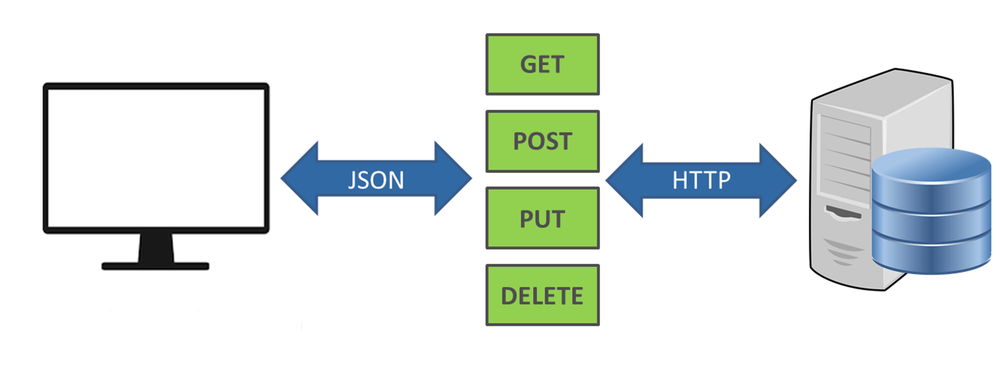
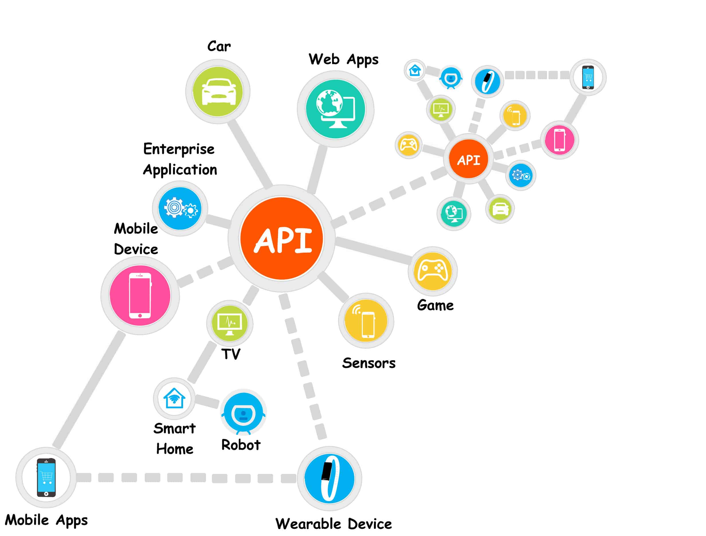

# Introduction to APIs 🛰

Now that we've introduced the course, it's time to answer one important question:

> **What is a Web API, and why is it one of the most important technologies in modern software development?**

In this lesson we'll learn:

- What Web APIs are
- What REST is
- Where Web APIs are used
- How to build a Web API using ASP.NET Core

---

# What are Web APIs? 🔸

Web APIs (Web Application Programming Interfaces) expose application functionality through HTTP requests instead of graphical user interfaces.

Unlike traditional web applications, Web APIs don't return HTML pages, CSS or Razor Views. Instead, they receive requests, process them and return responses, most commonly in **JSON** format.

Requests are the primary source of communication between clients and a Web API.

---

## What is an API?

Most web applications provide users with an interface such as an HTML page where they can interact with the application.

However, this is not the only way applications can expose their functionality.

Applications can also communicate directly by exchanging requests and responses. This allows the same application to expose its functionality to different clients without depending on a specific user interface.

This type of application is called an **API (Application Programming Interface)**.

Some common examples include:

- A mobile application requesting user information.
- A web application loading products from an online store.
- A payment gateway processing transactions.
- A weather application retrieving forecast data.

### 🤖 Let's Ask AI

```
Explain APIs using a restaurant analogy.
```

```
Explain APIs as if I'm completely new to programming.
```

```
Give me five real-world examples of APIs I probably use every day.
```

```
What's the difference between a website and an API?
```

---

# What is REST? 🔽

REST (**Representational State Transfer**) is one of the most common architectural styles for building Web APIs.

REST separates the client from the server by exposing representations of business data.

The client and the server don't need to know each other's internal implementation. They only need to agree on the format used to exchange information, most commonly **JSON**, although XML is also supported.

Applications that follow these principles are commonly referred to as **RESTful APIs**.



### 🤖 Let's Ask AI

```
Explain REST using simple language and practical examples.
```

```
Explain the REST constraints one by one.
```

```
Why is JSON more commonly used than XML?
```

```
What makes an API RESTful?
```

---

# Uses of Web APIs 🔽

One of the biggest advantages of APIs is that they are independent of the client consuming them.

An API is a standalone backend service that doesn't care who or what the client is.

As long as a client can send HTTP requests and process the response, it can communicate with the API.

A single API can be used by:

- Front-end web applications
- Mobile applications
- Desktop applications
- Console applications
- Other Web APIs
- Any other device capable of making HTTP requests

Instead of duplicating business logic across multiple applications, every client communicates with the same backend service.



### 🤖 Let's Ask AI

```
Give me examples where one API serves multiple clients.
```

```
Why are APIs important in modern software architecture?
```

```
How would applications communicate without APIs?
```

```
Give examples of companies that rely heavily on APIs.
```

---

# Visual Studio and Web APIs 🔸

Visual Studio provides a dedicated **.NET Web API** project template.

The template is already configured to work as a Web API and contains everything needed to start building APIs.

It automatically generates:

- The project structure
- Configuration files
- Controllers
- Sample endpoints
- Swagger (OpenAPI) support

This allows developers to focus on implementing business logic instead of configuring the project from scratch.

In the next lesson, we'll create our first .NET Web API project and explore its structure.

### 🤖 Let's Ask AI

```
Why does .NET have a separate Web API project template?
```

```
Explain the difference between .NET MVC and .NET Web API.
```

```
What is generated automatically when creating a new .NET Web API project?
```

---

## Questions?

If something isn't clear, ask during the lesson—chances are someone else has the same question too.