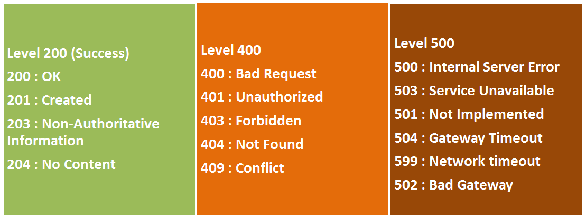
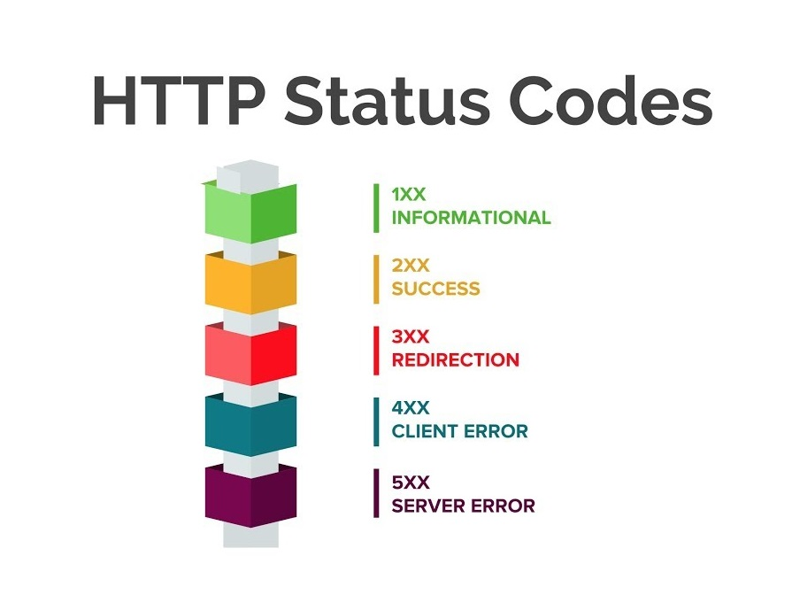

# HTTP Requests and Responses 🌐

Every interaction with a Web API happens through **HTTP (HyperText Transfer Protocol)**.

Whether you're requesting data, creating a new resource or updating an existing one, the communication always follows the HTTP protocol.

Understanding how HTTP works is one of the most important skills when building Web APIs.

---

# HTTP Requests 🔸

All communication with a Web API happens through HTTP.

Whenever a client wants to interact with an API, it sends an **HTTP Request**.

For every request sent to the server, there is always a corresponding **HTTP Response**.

An HTTP request consists of:

- HTTP Method
- Headers
- Body (optional)

Requests contain information about the client (caller) and tell the server what action should be performed.

---

## HTTP Methods

Every request has a purpose.

Should the server return data? Create something? Update existing data? Delete a resource?

This is defined by the **HTTP Method**.

The most common HTTP methods are:

| Method | Purpose |
|---------|---------|
| GET | Retrieve data |
| POST | Create new data |
| PUT | Replace existing data |
| PATCH | Partially update existing data |
| DELETE | Remove existing data |

Choosing the correct HTTP method makes your API easier to understand and follow REST principles.

---

### 🤖 Let's Ask AI

```text
Explain when to use GET, POST, PUT, PATCH and DELETE using practical examples.
```

```text
Give me examples of bad API design caused by using the wrong HTTP method.
```

```text
Why shouldn't GET requests modify data?
```

---

## HTTP Request Structure

An HTTP request consists of two main parts:

### Headers

Headers contain metadata about the request.

Some common headers include:

- Host
- User-Agent
- Accept
- Accept-Language
- Authorization
- Content-Type

The first line of every request is called the **Request Line**, and contains:

- HTTP Method
- URI
- HTTP Version

Example:

```http
GET /hello.htm HTTP/1.1
```

### Body

The request body is optional.

It's usually included when sending data to the server.

Most modern APIs send data as **JSON**.

---

### Example - GET Request

```http
GET /hello.htm HTTP/1.1
User-Agent: Mozilla/4.0
Host: www.mywebapp.com
Accept-Language: en-us
Connection: Keep-Alive
```

---

### Example - POST Request

```http
POST /hello.htm HTTP/1.1
Host: www.mywebapp.com
Content-Type: application/json
Content-Length: 205

{
  "users": {
    "firstName": "Bob",
    "lastName": "Bobsky",
    "address": {
      "street": "21 Bob Street",
      "city": "Bob York",
      "postalCode": 101010
    }
  }
}
```

---

### 🤖 Let's Ask AI

```text
Explain every line of this HTTP request.
```

```text
What information belongs in HTTP headers and what belongs in the body?
```

```text
Why is Content-Type important?
```

---

# HTTP Responses 🔸

After processing a request, the server sends an **HTTP Response**.

The response tells the client whether the request succeeded or failed and may also return data.

An HTTP response consists of:

- Status Code
- Headers
- Body

Responses contain information about the server and the result of processing the request.

---

### Example - HTTP Response (200 OK)

```http
HTTP/1.1 200 OK
Date: Mon, 27 Jul 2019 12:28:53 GMT
Server: Apache/2.2.14 (Win32)
Last-Modified: Wed, 22 Jul 2019 19:15:56 GMT
Content-Length: 88
Content-Type: text/html
Connection: Closed

<html>
<body>
 <h1>Hello, World!</h1>
</body>
</html>
```

---

### Example - HTTP Response (404 Not Found)

```http
HTTP/1.1 404 Not Found
Date: Sun, 18 Jul 2019 10:36:20 GMT
Server: Apache/2.2.14 (Win32)
Content-Length: 230
Connection: Closed
Content-Type: text/html
```

---

### 🤖 Let's Ask AI

```text
Explain every part of an HTTP response.
```

```text
Why does every HTTP request receive a response?
```

```text
What's the difference between request headers and response headers?
```

---

# Status Codes 🔸

Every response includes a **Status Code**.

Status codes tell the client what happened while processing the request.

A status code is made up of three digits:

- **First digit** – Represents the status category.
- **Second and third digits** – Represent the specific result.

The five status code categories are:

| Category | Description |
|----------|-------------|
| 1xx | Informational |
| 2xx | Success |
| 3xx | Redirection |
| 4xx | Client Errors |
| 5xx | Server Errors |



The most common status codes you'll encounter are:

- 200 OK
- 201 Created
- 204 No Content
- 400 Bad Request
- 401 Unauthorized
- 403 Forbidden
- 404 Not Found
- 500 Internal Server Error



---

### 🤖 Let's Ask AI

```text
Explain the most common HTTP status codes with practical examples.
```

```text
When should I return 400 instead of 404?
```

```text
What's the difference between 401 and 403?
```

```text
Give me ten interview questions about HTTP status codes.
```

---

# Returning Status Codes in .NET 🔸

Status codes are the standard way of informing clients about the result of a request.

.NET provides several helper methods for returning HTTP responses.

```csharp
[HttpGet("{id}")]
public ActionResult<string> Get(int id)
{
    if(id == 0)
    {
        return NotFound();
    }

    return _users.GetById(id).Name;
}
```

You can also return additional information together with the status code.

```csharp
[HttpGet("{id}")]
public ActionResult<string> Get(int id)
{
    if(id == 0)
    {
        return NotFound(new
        {
            message = "Try some other number!",
            suggestion = 1
        });
    }

    return _users.GetById(id).Name;
}
```

---

### 🤖 Let's Ask AI

```text
Explain when to return Ok(), Created(), BadRequest() and NotFound().
```

```text
Review this action and suggest better HTTP responses.
```

```text
What's the difference between returning an object and returning IActionResult?
```

---

# Reading Data from the Request Body 🔸

When clients send data to the API, it is included in the request body.

Although modern .NET applications usually rely on **Model Binding**, it's useful to understand that the body can also be read manually through the `Request` object.

```csharp
[HttpPost]
public void Post()
{
    using (StreamReader reader = new StreamReader(Request.Body))
    {
        string body = reader.ReadToEnd();
    }
}
```

Later in the course we'll see a much cleaner approach using model binding and DTOs.

---

### 🤖 Let's Ask AI

```text
Why don't we usually read Request.Body manually?
```

```text
Explain how Model Binding replaces manual body reading.
```

```text
When would manually reading Request.Body actually be useful?
```

---

# Extra Materials 📘

- https://developer.mozilla.org/en-US/docs/Web/HTTP/Status
- https://developer.mozilla.org/en-US/docs/Web/HTTP/Methods
- https://developer.mozilla.org/en-US/docs/Web/HTTP/Overview