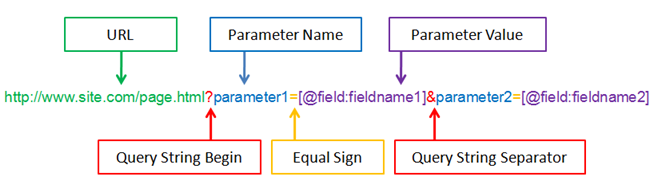

# Parameters and Model Binding 🚒

# Looking Back...

Before we continue, let's quickly revise:

- How do Web APIs communicate?
- What does an HTTP request contain?
- What are HTTP methods?
- What are status codes?
- What is the difference between a 4xx and a 5xx status code?

---

# Handling Query Parameters 🔸

URLs can be extended with additional values that the server can read.

These values are called **query parameters**.

Query parameters are written after the URL by adding a `?`.

The structure is:

```text
name=value
```

Multiple parameters are separated with `&`.

Example:

```text
http://mywebsite.com/api/dogs?type=good+boi&size=large
```

Result:

```text
Request URL:
http://mywebsite.com/api/dogs

Query parameters:
type = good boi
size = large
```

Query parameters are useful when we want to send smaller values directly through the URL, usually for filtering, searching, sorting or pagination.



### 🤖 Let's Ask AI

```text
Explain query parameters using a simple real-world example.
```

```text
Give me examples of query parameters used for filtering, searching and sorting.
```

```text
What is the difference between query parameters and request body?
```

---

# Path Variables 🔽

Path variables, also called **route parameters**, are values passed directly as part of the URL path.

Example:

```text
http://mywebsite.com/api/dogs/good
```

Result:

```text
Request URL:
http://mywebsite.com/api/dogs/good

Route in controller:
[HttpGet("good")] or [Route("good")]
```

Path variables are more strict than query parameters because the route must be defined in the controller action.

They are commonly used when we want to identify a specific resource.

Example:

```text
GET /api/users/5
GET /api/products/12
GET /api/orders/100
```

### 🤖 Let's Ask AI

```text
Explain the difference between query parameters and path variables.
```

```text
When should I use /api/users/5 and when should I use /api/users?id=5?
```

```text
Give me RESTful examples using route parameters.
```

---

# Model Binding 🔸

Actions in API controllers can automatically serialize, deserialize and bind incoming data to C# parameters or classes.

This means that .NET can read data from the request and automatically map it to the action parameters.

Model binding can be done from:

- The body of the request
- The query parameters
- The route parameters
- The headers of the request

---

# FromBody 🔽

When the client sends data in the body of the request, we can bind that data to a C# model using `[FromBody]`.

This is commonly used with `POST` and `PUT` requests.

Example JSON sent in the body:

```json
{
  "text": "Buy Milk",
  "color": "blue"
}
```

C# model:

```csharp
public class Note
{
    public string Text { get; set; }
    public string Color { get; set; }
}
```

Controller action:

```csharp
[HttpPost]
public IActionResult Post([FromBody] Note note)
{
    // note is populated with the JSON data from the request body
    return Ok(note);
}
```

### 🤖 Let's Ask AI

```text
Explain how FromBody works in .NET Web API.
```

```text
Why is FromBody commonly used with POST and PUT requests?
```

```text
Review this FromBody example and explain how the JSON becomes a C# object.
```

---

# FromQuery 🔽

Query parameters can be bound directly to action parameters.

Example:

```text
http://localhost:64329/api/notes?text=Buy+Milk
```

```csharp
[HttpPost]
public IActionResult Post(string text)
{
    // text = "Buy Milk"
    return Ok(text);
}
```

If we have multiple query parameters, we can bind them to a class using `[FromQuery]`.

```text
http://localhost:64329/api/notes?text=Buy+Milk&color=green
```

```csharp
[HttpPost]
public IActionResult Post([FromQuery] Note note)
{
    // note = { text: "Buy Milk", color: "green" }
    return Ok(note);
}
```

We can also bind additional query parameters by name.

```text
http://localhost:64329/api/notes?text=Buy+Milk&color=green&tag=Low+Priority
```

```csharp
[HttpPost]
public IActionResult Post(
    [FromQuery] Note note,
    [FromQuery(Name = "tag")] string tag)
{
    // note = { text: "Buy Milk", color: "green" }
    // tag = "Low Priority"

    return Ok();
}
```

### 🤖 Let's Ask AI

```text
Explain FromQuery with examples.
```

```text
When should I use FromQuery instead of FromBody?
```

```text
Create an example endpoint that filters products using query parameters.
```

---

# FromHeader 🔽

Headers can also be read from the request.

We can access them manually through the `Request` object, but a cleaner way is using `[FromHeader]`.

Example:

```csharp
[HttpPost]
public IActionResult Post([FromHeader] string host)
{
    // host = request host value
    return Ok(host);
}
```

We can also specify the exact header name.

```csharp
[HttpPost]
public IActionResult Post([FromHeader(Name = "Accept-Language")] string lang)
{
    // lang = en-US
    return Ok(lang);
}
```

Headers are commonly used for metadata, authentication, content type, language preferences and other request information.

### 🤖 Let's Ask AI

```text
Explain what HTTP headers are used for.
```

```text
When would I read data from headers instead of query parameters or body?
```

```text
Explain FromHeader with a real API example.
```